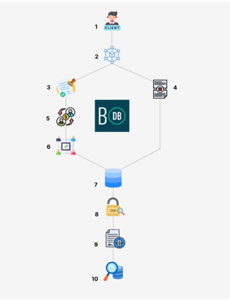

# Workflow

## Clients

Digital Participants: Clients are the digital participants in the BigchainDB network. They're like the people who connect to a digital gathering.

## Nodes

Network Components: Nodes serve as essential components in the BigchainDB network, much like the various parts that make up a computer.

### Validating Nodes

Verification Enforcers: Validating nodes act as verification enforcers. They ensure transactions meet BigchainDB's rules before accepting them, similar to security personnel checking IDs at a venue.

### Non-validating Nodes

Data Replicators: Non-validating nodes replicate data, similar to creating backup copies to ensure information is always available.

## Transaction Propagation

Information Flow: Transaction propagation is the way information moves within the network, like how news spreads among friends in a social circle.

## Consensus Mechanism

Shared Decision-Making: BigchainDB's consensus mechanism involves shared decision-making, like friends discussing and agreeing on a plan before moving forward.

## Database Storage

Information Storage: Data in BigchainDB is stored systematically, similar to organizing a library catalog.

## Decentralization and Immutability

Shared Trust and Protection: BigchainDB provides shared trust and protection, like a community coming together to safeguard something important.

## Smart Contracts

Automated Actions: Smart contracts automate actions based on predefined conditions, much like a timer turning on lights when it gets dark.

## Data Querying

Information Requests: Clients can request information from the BigchainDB database, just as you might ask for directions when exploring a new place.