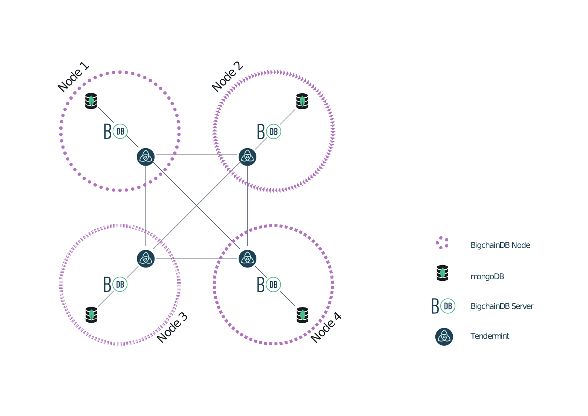

.. Copyright BigchainDB GmbH and BigchainDB contributors
   SPDX-License-Identifier: (Apache-2.0 AND CC-BY-4.0)
   Code is Apache-2.0 and docs are CC-BY-4.0

Querying BigchainDB
===================

A node operator can use the full power of MongoDB's query engine to search and query all stored data, including all transactions, assets and metadata.
The node operator can decide for themselves how much of that query power they expose to external users.

Blog Post with Example Queries
------------------------------

We wrote a blog post in The BigchainDB Blog to show
how to use some MongoDB tools to query a BigchainDB node's MongoDB database.
It includes some specific example queries for data
about custom cars and their ownership histories.
`Check it out <https://blog.bigchaindb.com/using-mongodb-to-query-bigchaindb-data-3fc651e0861b>`_.

How to Connect to MongoDB
-------------------------

Before you can query a MongoDB database, you must connect to it, and to do that, you need to know its hostname and port.

If you're running a BigchainDB node on your local machine (e.g. for dev and test), then the hostname should be ``localhost`` and the port should be ``27017``, unless you did something to change those values. If you're running a BigchainDB node on a remote machine and you can SSH to that machine, then the same is true.

If you're running a BigchainDB node on a remote machine and you configured its MongoDB to use auth and to be publicly-accessible (to people with authorization), then you can probably figure out its hostname and port.

How to Query
------------

A BigchainDB node operator has full access to their local MongoDB instance, so they can use any of MongoDB's APIs for running queries, including:

- `the Mongo Shell <https://docs.mongodb.com/manual/mongo/>`_,
- `MongoDB Compass <https://www.mongodb.com/products/compass>`_,
- one of `the MongoDB drivers <https://docs.mongodb.com/ecosystem/drivers/>`_, such as `PyMongo <https://api.mongodb.com/python/current/>`_, or
- a third-party tool for doing MongoDB queries, such as RazorSQL, Studio 3T, Mongo Management Studio, NoSQLBooster for MongoDB, or Dr. Mongo.

.. note::

   It's possible to do query a MongoDB database using SQL. For example:
   
   * Studio 3T: "`How to Query MongoDB with SQL <https://studio3t.com/whats-new/how-to-query-mongodb-with-sql/>`_"
   * NoSQLBooster for MongoDB: "`How to Query MongoDB with SQL SELECT <https://mongobooster.com/blog/query-mongodb-with-sql/>`_"

For example, if you're on a machine that's running a default BigchainDB node, then you can connect to it using the Mongo Shell (``mongo``) and look around like so:

.. code::

    $ mongo
    MongoDB shell version v3.6.5
    connecting to: mongodb://127.0.0.1:27017
    MongoDB server version: 3.6.4
    ...
    > show dbs
    admin     0.000GB
    bigchain  0.000GB
    config    0.000GB
    local     0.000GB
    > use bigchain
    switched to db bigchain
    > show collections
    abci_chains
    assets
    blocks
    elections
    metadata
    pre_commit
    transactions
    utxos
    validators

The above example illustrates several things:

* When you don't specify the hostname or port, the Mongo Shell assumes they are ``localhost`` and ``27017``, respectively. (``localhost`` had IP address 127.0.0.1 on the machine in question, an Ubuntu machine.)
* BigchainDB stores its data in a database named ``bigchain``.
* The ``bigchain`` database contains several `collections <https://docs.mongodb.com/manual/core/databases-and-collections/>`_.
* Votes aren't stored in any collection, currently. They are all handled and stored by Tendermint in its own (LevelDB) database.

Example Documents from Some Collections
---------------------------------------

The most interesting collections in the ``bigchain`` database are:

- transactions
- assets
- metadata
- blocks

You can explore those collections using MongoDB queries such as ``db.assets.findOne()``. We now show some example documents from each of those collections.

Example Documents from transactions
~~~~~~~~~~~~~~~~~~~~~~~~~~~~~~~~~~~

A CREATE transaction from the transactions collection includes an extra ``"_id"`` field (added by MongoDB) and is missing its ``"asset"`` and ``"metadata"`` fields: that data was removed and stored in the assets and metadata collections.

.. code::

    {  
        "_id":ObjectId("5b17b9fa6ce88300067b6804"),
        "inputs":[…],
        "outputs":[…],
        "operation":"CREATE",
        "version":"2.0",
        "id":"816c4dd7…851af1629"
    }

A TRANSFER transaction from the transactions collection is similar, but it keeps its ``"asset"`` field.

.. code::

    {  
        "_id":ObjectId("5b17b9fa6ce88300067b6807"),
        "inputs":[…],
        "outputs":[…],
        "operation":"TRANSFER",
        "asset":{  
            "id":"816c4dd7ae…51af1629"
        },
        "version":"2.0",
        "id":"985ee697d…a3296b9"
    }

Example Document from assets
~~~~~~~~~~~~~~~~~~~~~~~~~~~~

A document from the assets collection has three top-level fields: an ``"_id"`` field added by MongoDB, the ``asset.data`` from a CREATE transaction, and the ``"id"`` of the CREATE transaction it came from.

.. code::

    {  
        "_id":ObjectId("5b17b9fe6ce88300067b6823"),
        "data":{  
            "type":"cow",
            "name":"Mildred"
        },
        "id":"96002ef8740…45869959d8"
    }

Example Document from metadata
~~~~~~~~~~~~~~~~~~~~~~~~~~~~~~

A document from the metadata collection has three top-level fields: an ``"_id"`` field added by MongoDB, the ``metadata`` from a transaction, and the ``"id"`` of the transaction it came from.

.. code::

    {  
        "_id":ObjectId("5b17ba006ce88300067b683d"),
        "metadata":{
            "transfer_time":1058568256
        },
        "id":"53cba620e…ae9fdee0"
    }

Example Document from blocks
~~~~~~~~~~~~~~~~~~~~~~~~~~~~

.. code::

    {
        "_id":ObjectId("5b212c1ceaaa420006f41c57"),
        "app_hash":"2b0b75c2c2…7fb2652ce26c6",
        "height":17,
        "transactions":[
            "5f1f2d6b…ed98c1e"
        ]
    }

What a Node Operator Can Expose to External Users
-------------------------------------------------

Each node operator can decide how they let external users get information from their local MongoDB database. They could expose:

- their local MonogoDB database itself to queries from external users, maybe as a MongoDB user with a role that has limited privileges, e.g. read-only.
- a limited HTTP API, allowing a restricted set of predefined queries, such as `the HTTP API provided by BigchainDB Server <http://bigchaindb.com/http-api>`_, or a custom HTTP API implemented using Django, Express, Ruby on Rails, or ASP.NET.
- some other API, such as a GraphQL API. They could do that using custom code or code from a third party.

Each node operator can expose a different level or type of access to their local MongoDB database.
For example, one node operator might decide to specialize in offering optimized `geospatial queries <https://docs.mongodb.com/manual/reference/operator/query-geospatial/>`_.

Security Considerations
-----------------------

In BigchainDB version 1.3.0 and earlier, there was one logical MongoDB database, so exposing that database to external users was very risky, and was not recommended.
"Drop database" would delete that one shared MongoDB database.

In BigchainDB version 2.0.0 and later, each node has its own isolated local MongoDB database.
Inter-node communications are done using Tendermint protocols, not MongoDB protocols, as illustrated in Figure 1 below.
If a node's local MongoDB database gets compromised, none of the other MongoDB databases (in the other nodes) will be affected.

   
   Figure 1: A Four-Node BigchainDB 2.0 Network

.. raw:: html

    
    
    

Performance and Cost Considerations
-----------------------------------

Query processing can be quite resource-intensive, so it's a good idea to have MongoDB running in a separate machine from those running BigchainDB Server and Tendermint Core.

A node operator might want to measure the resources used by a query, so they can charge whoever requested the query accordingly.

Some queries can take too long or use too many resources. A node operator should put upper bounds on the resources that a query can use, and halt (or prevent) any query that goes over.

To make MongoDB queries more efficient, one can create `indexes <https://docs.mongodb.com/manual/indexes/>`_. Those indexes might be created by the node operator or by some external users (if the node operator allows that). It's worth noting that indexes aren't free: whenever new data is appended to a collection, the corresponding indexes must be updated. The node operator might want to pass those costs on to whoever created the index. Moreover, in MongoDB, `a single collection can have no more than 64 indexes <https://docs.mongodb.com/manual/reference/limits/#Number-of-Indexes-per-Collection>`_.

One can create a follower node: a node with Tendermint voting power 0. It would still have a copy of all the data, so it could be used as read-only node. A follower node could offer specialized queries as a service without affecting the workload on the voting validators (which can also write). There could even be followers of followers.

JavaScript Query Code Examples
------------------------------

One can connect to a node's MongoDB database using any
of the MongoDB drivers, such as `the MongoDB Node.js driver 
<https://mongodb.github.io/node-mongodb-native/?jmp=docs>`_.
Here are some links to example JavaScript code that queries a
BigchainDB node's MongoDB database:

- `The BigchainDB JavaScript/Node.js driver source code <https://github.com/bigchaindb/js-bigchaindb-driver>`_
- `Example code by @manolodewiner <https://github.com/manolodewiner/query-mongodb-bigchaindb/blob/master/queryMongo.js>`_
- `More example code by @manolodewiner <https://github.com/bigchaindb/bigchaindb/issues/2315#issuecomment-392724279>`_
