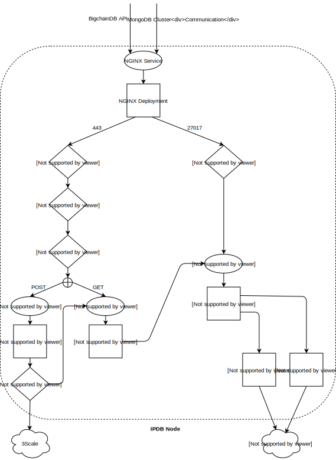

Architecture of an IPDB Node
============================

An IPDB Production deployment is hosted on a Kubernetes cluster and includes:

* NGINX, OpenResty, BigchainDB and MongoDB
  `Kubernetes Services <https://kubernetes.io/docs/concepts/services-networking/service/>`_.
* NGINX, OpenResty, BigchainDB, Monitoring Agent and Backup Agent
  `Kubernetes Deployments <https://kubernetes.io/docs/concepts/workloads/controllers/deployment/>`_.
* MongoDB `Kubernetes StatefulSet <https://kubernetes.io/docs/concepts/workloads/controllers/statefulset/>`_.
* External systems like `3scale <https://3scale.net>`_,
  `MongoDB Cloud Manager <https://cloud.mongodb.com>`_ and the
  `Azure Operations Management Suite
  <https://docs.microsoft.com/en-us/azure/operations-management-suite/>`_.

We describe the role of each of these modules here.

NGINX
-----

We use an NGINX as HTTP proxy on port 443 at the cloud entrypoint for:

#. Rate Limiting: We configure NGINX to allow only a certain number of requests
   (configurable) which prevents DoS attacks.

#. HTTPS Termination: The HTTPS connection does not carry through all the way
   to BigchainDB and terminates at NGINX for now.

#. Request Routing: For HTTPS connections on port 443 (or the configured BigchainDB public api port),
   the connection is proxied to:

   #. OpenResty Service if it is a POST request.
   #. BigchainDB Service if it is a GET request.

We use an NGINX TCP proxy on port 27017 at the cloud entrypoint for:

#. Rate Limiting: We configure NGINX to allow only a certain number of requests
   (configurable) which prevents DoS attacks.

#. Request Routing: For connections on port 27017 (or the configured MongoDB
   public api port), the connection is proxied to the MongoDB Service.

OpenResty
---------

We use `OpenResty <https://openresty.org/>`_ to perform authorization checks
with 3scale using the ``app_id`` and ``app_key`` headers in the HTTP request.

OpenResty is NGINX plus a bunch of other
`components <https://openresty.org/en/components.html>`_. We primarily depend
on the LuaJIT compiler to execute the functions to authenticate the ``app_id``
and ``app_key`` with the 3scale backend.

MongoDB
-------

We use MongoDB as the backend database for BigchainDB.
In a multi-node deployment, MongoDB members communicate with each other via the
public port exposed by the NGINX Service. 

We achieve security by avoiding DoS attacks at the NGINX proxy layer and by
ensuring that MongoDB has TLS enabled for all its connections.

