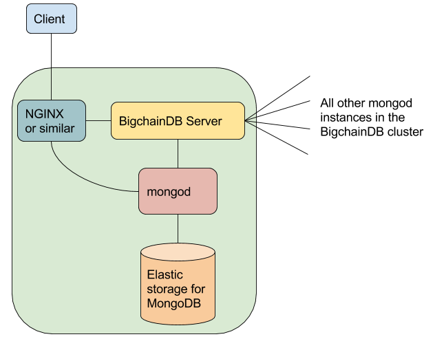

<!---
Copyright BigchainDB GmbH and BigchainDB contributors
SPDX-License-Identifier: (Apache-2.0 AND CC-BY-4.0)
Code is Apache-2.0 and docs are CC-BY-4.0
--->

# Production Node Components

A production BigchainDB node must include:

* BigchainDB Server
* MongoDB Server 3.4+ (mongod)
* Tendermint
* Storage for MongoDB and Tendermint

It could also include several other components, including:

* NGINX or similar, to provide authentication, rate limiting, etc.
* An NTP daemon running on all machines running BigchainDB Server or mongod, and possibly other machines
* Probably _not_ MongoDB Automation Agent. It's for automating the deployment of an entire MongoDB cluster.
* MongoDB Monitoring Agent
* MongoDB Backup Agent
* Log aggregation software
* Monitoring software
* Maybe more

The relationship between the main components is illustrated below.

