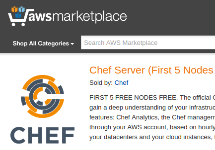

# Set Up Chef Server on AWS

First, you need to get set up on AWS. See [the page about AWS Setup in the Appendices](../appendices/aws-setup.html).

Chef Software, Inc. provides an official Chef Server AMI (Amazon Machine Image) on the AWS Marketplace. They also wrote [documentation about it](https://docs.chef.io/aws_marketplace.html).

You may notice that the product page is titled "Chef Server (First 5 Nodes Free)". Chef Server [is open source (Apache v2)](https://github.com/chef/chef-server/blob/master/LICENSE), so you may wonder why it would ever be non-free. The answer, we think, is that the AMI's license includes a fast-response support channel and some premium (non-open-source) features such as Chef Analytics, Chef Management Console and Chef Reporting. For the full answer, see the End User License Agreement linked-to on the product page (in AWS Marketplace). You can leave the premium features disabled if you don't want to pay for them.

Five "nodes" (Chef nodes, i.e. machines other than the one running Chef Server) will be enough to build a basic BigchainDB Node, so this may be a good option.

If you prefer to provision your own EC2 instance and install Chef Server on that, then see the options listed on the page titled [Set Up Chef Server (General)](setup-chef-server-general.html).

Note that not all AWS regions are supported. The region you choose should also be used to host all the other machines in your BigchainDB node.

If you decide to subscribe for the official Chef Server AMI, then here are some steps and tips:

1. Go to the product page for "Chef Server (First 5 Nodes Free)" on the AWS Marketplace.

2. Click **Continue**

3. Select the latest version of Chef Server from the drop-down menu.

4. Click **Accept Software Terms**

5. You may not get an email, but in the AWS Marketplace website, if you click **Your Account** and **Manage your software subscriptions**, then your new subscription should be listed.

6. For the Chef Server product, click **Launch more software**

7. Click **Continue** on the Chef Server product page.

8. This time around, the **Launch with EC2 Console** buttons should not be greyed out. Click the one for the region where you want to launch your Chef Server.

9. On the "Step 2: Choose an Instance Type" page, the t2.medium instance type should suffice, but you can choose something bigger if you like. (The [Chef Server requirements are listed in the Chef documentation](https://docs.chef.io/chef_system_requirements.html#chef-server-title-on-premises). Look under "standalone deployment." Note that if you want to use Chef Analytics, you'll need more RAM.)

10. Click **Next: Configure Instance Details**

11. On the "Step 3: Configure Instance Details" page, you'll notice a red box around **IAM role** because "The AMI you have selected... requires an IAM role." Click **Create new IAM role**

12. Click **Create New Role**, name it `EC2_AWSMarketplaceFullAccess` (or whatever you like), click **Next Step**, select "Amazon EC2", enter `AWSMarketplaceFullAccess` into the search field, check the box beside AWSMarketplaceFullAccess, click **Next Step**, and click **Create Role**

13. Beside "Auto-assign Public IP" select "Enable"

14. Beside "Enable termination protection", check the box beside "Protect against accidental termination"

15. You can probably leave the other things on that page at their default values for now, but be sure to read what they mean. We'll revisit these instrutions in the future. In particular, it may be worthwhile (e.g. more secure) to create a special VPC and/or subnet for your BigchainDB node.

16. Click **Next: Add Storage**

17. As mentioned earlier, the [Chef Server requirements are listed in the Chef documentation](https://docs.chef.io/chef_system_requirements.html#chef-server-title-on-premises). Look under "standalone deployment." Note that 5 GB of free disk space is needed in `/opt` and another 5 GB is needed in `/var`. The operating system also needs some storage space. To be safe, 12 GB should be enough. You can ask Google to convert that to GiB: just search for "12 GB in GiB". The answer is: 11 GiB (approximately).

18. You can probably get away with "Magnetic" storage (under "Volume Type"), rather than "General Purpose SSD (GP2)" (which is more expensive), because this Chef Server will only be dealing with a handful of machines, but we'll leave that decision up to you.

19. Uncheck the box below "Delete on Termination." It's unlikely that the instance will get terminated, but if it is, it would be handy to have the associated storage still around to make it easier to figure out what happened, and to provide a starting point for recovery.

20. Click **Next: Tag Instance**

21. Give your Chef Server instance (machine) a Name tag like `Chef-Server`.

22. Click **Next: Configure Security Group**

23. Create a **new** security group named `chef-server-1`, with an appropriate description, and the following rules:

    * SSH - TCP - 22 - Anywhere - 0.0.0.0/0
    * HTTPS - TCP - 443 - Anywhere - 0.0.0.0/0
    * Custom TCP Rule - TCP - 8443 - Anywhere - 0.0.0.0/0

24. Click **Review and Launch**

25. Review everything. If you want to change something, you can: Just click the **Previous** button in the lower right corner.

26. Click **Launch**

27. Select an existing key pair or create a new key pair? Create a new key pair. Name it `chef-server-key`.

28. Click **Download Key Pair** and save it somewhere you'll remember.

29. Click **Launch Instances**

 

There is some [official AWS documentation about installing Chef Server on the AWS cloud](https://docs.aws.amazon.com/quickstart/latest/chef-server/welcome.html), but it's a bit dated and links to some out-of-date AWS Marketplace products. Nevertheless, you may want to browse that documentation because it explains what gets deployed.

**About AWS OpsWorks**

You might be tempted to use [AWS OpsWorks](https://aws.amazon.com/opsworks/) instead of setting up your own Chef Server etc. It's somewhat like a managed hosted version of Chef; one even uses Chef recipes with it. There are at least three problems though:

1. Once you start using AWS OpsWorks, you're effectively locked in to AWS, because it has features that you can't move to another cloud hosting provider (e.g. "stacks," "layers," and deep integrations with other AWS services).
2. AWS Opsworks doesn't integrate with _all_ AWS services.
3. The team behind BigchainDB wants to avoid maintaining and documenting specialized operations tooling for each cloud provider. There might be _some_, but it should be minimial.
