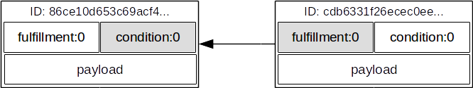
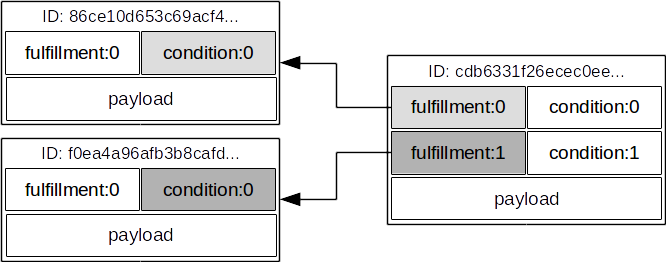

# The Python Server API by Example

This section gives an example of using the Python Server API to interact _directly_ with a BigchainDB node running BigchainDB Server. That is, in this example, the Python code and BigchainDB Server run on the same machine.

(One can also interact with a BigchainDB node via other APIs, including the HTTP Client-Server API.) 

We create a digital asset, sign it, write it to a BigchainDB Server instance, read it, transfer it to a different user, and then attempt to transfer it to another user, resulting in a double-spend error.

## Getting Started

First, make sure you have RethinkDB and BigchainDB _installed and running_, i.e. you [installed them](installing-server.html) and you ran:
```text
$ rethinkdb
$ bigchaindb configure
$ bigchaindb init
$ bigchaindb start
```

Don't shut them down! In a new terminal, open a Python shell:
```text
$ python
```

Now we can import the `Bigchain` class and create an instance:
```python
from bigchaindb import Bigchain
b = Bigchain()
```

This instantiates an object `b` of class `Bigchain`. When instantiating a `Bigchain` object without arguments (as above), it reads the configurations stored in `$HOME/.bigchaindb`.

In a federation of BigchainDB nodes, each node has its own `Bigchain` instance.

The `Bigchain` class is the main API for all BigchainDB interactions, right now. It does things that BigchainDB nodes do, but it also does things that BigchainDB clients do. In the future, it will be broken apart into a node/server class and a client class.

The `Bigchain` class is documented in the [Developer Interface](developer-interface.html) section.

## Create a Digital Asset

At a high level, a "digital asset" is something which can be represented digitally and can be assigned to a user. In BigchainDB, users are identified by their public key, and the data payload in a digital asset is represented using a generic [Python dict](https://docs.python.org/3.4/tutorial/datastructures.html#dictionaries).

In BigchainDB, only the federation nodes are allowed to create digital assets, by doing a special kind of transaction: a `CREATE` transaction.

```python
from bigchaindb import crypto

# create a test user
testuser1_priv, testuser1_pub = crypto.generate_key_pair()

# define a digital asset data payload
digital_asset_payload = {'msg': 'Hello BigchainDB!'}

# a create transaction uses the operation `CREATE` and has no inputs
tx = b.create_transaction(b.me, testuser1_pub, None, 'CREATE', payload=digital_asset_payload)

# all transactions need to be signed by the user creating the transaction
tx_signed = b.sign_transaction(tx, b.me_private)

# write the transaction to the bigchain
# the transaction will be stored in a backlog where it will be validated,
# included in a block, and written to the bigchain 
b.write_transaction(tx_signed)
```

## Read the Creation Transaction from the DB

After a couple of seconds, we can check if the transactions was included in the bigchain:
```python
# retrieve a transaction from the bigchain
tx_retrieved = b.get_transaction(tx_signed['id'])
tx_retrieved
```

```python
{
    "id":"933cd83a419d2735822a2154c84176a2f419cbd449a74b94e592ab807af23861",
    "transaction":{
        "conditions":[
            {
                "cid":0,
                "condition":{
                    "details":{
                        "bitmask":32,
                        "public_key":"BwuhqQX8FPsmqYiRV2CSZYWWsSWgSSQQFHjqxKEuqkPs",
                        "signature":None,
                        "type":"fulfillment",
                        "type_id":4
                    },
                    "uri":"cc:4:20:oqXTWvR3afHHX8OaOO84kZxS6nH4GEBXD4Vw8Mc5iBo:96"
                },
                "new_owners":[
                    "BwuhqQX8FPsmqYiRV2CSZYWWsSWgSSQQFHjqxKEuqkPs"
                ]
            }
        ],
        "data":{
            "hash":"872fa6e6f46246cd44afdb2ee9cfae0e72885fb0910e2bcf9a5a2a4eadb417b8",
            "payload":{
                "msg":"Hello BigchainDB!"
            }
        },
        "fulfillments":[
            {
                "current_owners":[
                    "3LQ5dTiddXymDhNzETB1rEkp4mA7fEV1Qeiu5ghHiJm9"
                ],
                "fid":0,
                "fulfillment":"cf:4:Iq-BcczwraM2UpF-TDPdwK8fQ6IXkD_6uJaxBZd984yxCGX7Csx-S2FBVe8LVyW2sAtmjsOSV0oiw9-s_9qSJB0dDUl_x8YQk5yxNdQyNVWVM1mWSGQL68gMngdmFG8O",
                "input":None
            }
        ],
        "operation":"CREATE",
        "timestamp":"1460981667.449279"
    },
    "version":1
}

```

The new owner of the digital asset is now `BwuhqQX8FPsmqYiRV2CSZYWWsSWgSSQQFHjqxKEuqkPs`, which is the public key of `testuser1`.

Note that the current owner with public key `3LQ5dTiddXymDhNzETB1rEkp4mA7fEV1Qeiu5ghHiJm9` refers to one of the federation nodes that actually created the asset and assigned it to `testuser1`.

## Transfer the Digital Asset

Now that `testuser1` has a digital asset assigned to him, he can transfer it to another user. Transfer transactions require an input. The input will be the transaction id of a digital asset that was assigned to `testuser1`, which in our case is `cdb6331f26ecec0ee7e67e4d5dcd63734e7f75bbd1ebe40699fc6d2960ae4cb2`.

BigchainDB makes use of the crypto-conditions library to both cryptographically lock and unlock transactions.
The locking script is refered to as a `condition` and a corresponding `fulfillment` unlocks the condition of the `input_tx`. 

Since a transaction can have multiple outputs with each their own (crypto)condition, each transaction input should also refer to the condition index `cid`.




```python
# Create a second testuser
testuser2_priv, testuser2_pub = crypto.generate_key_pair()

# Retrieve the transaction with condition id
tx_retrieved_id = b.get_owned_ids(testuser1_pub).pop()
tx_retrieved_id
```

```python
{
    "cid":0,
    "txid":"933cd83a419d2735822a2154c84176a2f419cbd449a74b94e592ab807af23861"
}
```

```python
# Create a transfer transaction
tx_transfer = b.create_transaction(testuser1_pub, testuser2_pub, tx_retrieved_id, 'TRANSFER')

# Sign the transaction
tx_transfer_signed = b.sign_transaction(tx_transfer, testuser1_priv)

# Write the transaction
b.write_transaction(tx_transfer_signed)

# Check if the transaction is already in the bigchain
tx_transfer_retrieved = b.get_transaction(tx_transfer_signed['id'])
tx_transfer_retrieved
```

```python
{
    "id":"aa11365317cb89bfdae2375bae76d6b8232008f8672507080e3766ca06976dcd",
    "transaction":{
        "conditions":[
            {
                "cid":0,
                "condition":{
                    "details":{
                        "bitmask":32,
                        "public_key":"qv8DvdNG5nZHWCP5aPSqgqxAvaPJpQj19abRvFCntor",
                        "signature":None,
                        "type":"fulfillment",
                        "type_id":4
                    },
                    "uri":"cc:4:20:DIfyalZvV_9ukoO01mxmK3nxsfAWSKYYF33XDYkbY4E:96"
                },
                "new_owners":[
                    "qv8DvdNG5nZHWCP5aPSqgqxAvaPJpQj19abRvFCntor"
                ]
            }
        ],
        "data":None,
        "fulfillments":[
            {
                "current_owners":[
                    "BwuhqQX8FPsmqYiRV2CSZYWWsSWgSSQQFHjqxKEuqkPs"
                ],
                "fid":0,
                "fulfillment":"cf:4:oqXTWvR3afHHX8OaOO84kZxS6nH4GEBXD4Vw8Mc5iBqzkVR6cFJhRvMGKa-Lc81sdYWVu0ZSMPGht-P7s6FZLkRXDqrwwInabLhjx14eABY34oHb6IyWcB-dyQnlVNEI",
                "input":{
                    "cid":0,
                    "txid":"933cd83a419d2735822a2154c84176a2f419cbd449a74b94e592ab807af23861"
                }
            }
        ],
        "operation":"TRANSFER",
        "timestamp":"1460981677.472037"
    },
    "version":1
}
```

## Double Spends

BigchainDB makes sure that a user can't transfer the same digital asset two or more times (i.e. it prevents double spends).

If we try to create another transaction with the same input as before, the transaction will be marked invalid and the validation will throw a double spend exception:

```python
# Create another transfer transaction with the same input
tx_transfer2 = b.create_transaction(testuser1_pub, testuser2_pub, tx_retrieved_id, 'TRANSFER')

# Sign the transaction
tx_transfer_signed2 = b.sign_transaction(tx_transfer2, testuser1_priv)

# Check if the transaction is valid
b.validate_transaction(tx_transfer_signed2)
```

```python
DoubleSpend: input `{'cid': 0, 'txid': '933cd83a419d2735822a2154c84176a2f419cbd449a74b94e592ab807af23861'}` was already spent
```

## Multiple Owners

When creating a transaction to a group of people with shared ownership of the asset, one can simply provide a list of `new_owners`:

```python
# Create a new asset and assign it to multiple owners
tx_multisig = b.create_transaction(b.me, [testuser1_pub, testuser2_pub], None, 'CREATE')

# Have the federation sign the transaction
tx_multisig_signed = b.sign_transaction(tx_multisig, b.me_private)
b.write_transaction(tx_multisig_signed)

# Check if the transaction is already in the bigchain
tx_multisig_retrieved = b.get_transaction(tx_multisig_signed['id'])
tx_multisig_retrieved
```

```python
{
    "id":"a9a6e5c74ea02b8885c83125f1b74a2ba8ca42236ec5e1c358aa1053ec721ccb",
    "transaction":{
        "conditions":[
            {
                "cid":0,
                "condition":{
                    "details":{
                        "bitmask":41,
                        "subfulfillments":[
                            {
                                "bitmask":32,
                                "public_key":"BwuhqQX8FPsmqYiRV2CSZYWWsSWgSSQQFHjqxKEuqkPs",
                                "signature":None,
                                "type":"fulfillment",
                                "type_id":4,
                                "weight":1
                            },
                            {
                                "bitmask":32,
                                "public_key":"qv8DvdNG5nZHWCP5aPSqgqxAvaPJpQj19abRvFCntor",
                                "signature":None,
                                "type":"fulfillment",
                                "type_id":4,
                                "weight":1
                            }
                        ],
                        "threshold":2,
                        "type":"fulfillment",
                        "type_id":2
                    },
                    "uri":"cc:2:29:DpflJzUSlnTUBx8lD8QUolOA-M9nQnrGwvWSk7f3REc:206"
                },
                "new_owners":[
                    "BwuhqQX8FPsmqYiRV2CSZYWWsSWgSSQQFHjqxKEuqkPs",
                    "qv8DvdNG5nZHWCP5aPSqgqxAvaPJpQj19abRvFCntor"
                ]
            }
        ],
        "data":None,
        "fulfillments":[
            {
                "current_owners":[
                    "3LQ5dTiddXymDhNzETB1rEkp4mA7fEV1Qeiu5ghHiJm9"
                ],
                "fid":0,
                "fulfillment":"cf:4:Iq-BcczwraM2UpF-TDPdwK8fQ6IXkD_6uJaxBZd984z5qdHRz9Jag68dkOyZS5_YoTR_0WpwiUnBGoNgwjwEuIn5JNm7Kksi0nUnHsWssyXISkmqRnHH-30HQhKjznIH",
                "input":None
            }
        ],
        "operation":"CREATE",
        "timestamp":"1460981687.501433"
    },
    "version":1
}
```

The asset can be transfered as soon as each of the `new_owners` signs the transaction.

To do so, simply provide a list of all private keys to the signing routine:

```python
# Create a third testuser
testuser3_priv, testuser3_pub = crypto.generate_key_pair()

# Retrieve the multisig transaction
tx_multisig_retrieved_id = b.get_owned_ids(testuser2_pub).pop()

# Transfer the asset from the 2 owners to the third testuser 
tx_multisig_transfer = b.create_transaction([testuser1_pub, testuser2_pub], testuser3_pub, tx_multisig_retrieved_id, 'TRANSFER')

# Sign with both private keys
tx_multisig_transfer_signed = b.sign_transaction(tx_multisig_transfer, [testuser1_priv, testuser2_priv])

# Write to bigchain
b.write_transaction(tx_multisig_transfer_signed)

# Check if the transaction is already in the bigchain
tx_multisig_retrieved = b.get_transaction(tx_multisig_transfer_signed['id'])
tx_multisig_retrieved
```

```python
{
    "assignee":"3LQ5dTiddXymDhNzETB1rEkp4mA7fEV1Qeiu5ghHiJm9",
    "id":"e689e23f774e7c562eeb310c7c712b34fb6210bea5deb9175e48b68810029150",
    "transaction":{
        "conditions":[
            {
                "cid":0,
                "condition":{
                    "details":{
                        "bitmask":32,
                        "public_key":"8YN9fALMj9CkeCcmTiM2kxwurpkMzHg9RkwSLJKMasvG",
                        "signature":None,
                        "type":"fulfillment",
                        "type_id":4
                    },
                    "uri":"cc:4:20:cAq6JQJXtwlxURqrksiyqLThB9zh08ZxSPLTDSaReYE:96"
                },
                "new_owners":[
                    "8YN9fALMj9CkeCcmTiM2kxwurpkMzHg9RkwSLJKMasvG"
                ]
            }
        ],
        "data":None,
        "fulfillments":[
            {
                "current_owners":[
                    "BwuhqQX8FPsmqYiRV2CSZYWWsSWgSSQQFHjqxKEuqkPs",
                    "qv8DvdNG5nZHWCP5aPSqgqxAvaPJpQj19abRvFCntor"
                ],
                "fid":0,
                "fulfillment":"cf:4:oqXTWvR3afHHX8OaOO84kZxS6nH4GEBXD4Vw8Mc5iBrcuiGDNVgpH9SwiuNeYZ-nugSTbxykH8W1eH5UJiunmnBSlKnJb8_QYOQsMAXl3MyLq2pWAyI45ZSG1rr2CksI",
                "input":{
                    "cid":0,
                    "txid":"aa11365317cb89bfdae2375bae76d6b8232008f8672507080e3766ca06976dcd"
                }
            }
        ],
        "operation":"TRANSFER",
        "timestamp":"1460981697.526878"
    },
    "version":1
}
```

## Multiple Inputs and Outputs

With BigchainDB it is possible to send multiple assets to someone in a single transfer.

The transaction will create a `fulfillment` - `condition` pair for each input, which can be refered to by `fid` and `cid` respectively.



```python
# Create some assets for bulk transfer
for i in range(3):
    tx_mimo_asset = b.create_transaction(b.me, testuser1_pub, None, 'CREATE')
    tx_mimo_asset_signed = b.sign_transaction(tx_mimo_asset, b.me_private)
    b.write_transaction(tx_mimo_asset_signed)

# Wait until they appear on the bigchain and get the inputs
owned_mimo_inputs = b.get_owned_ids(testuser1_pub)

# Check the number of assets
print(len(owned_mimo_inputs))

# Create a TRANSFER transaction with all the assets
tx_mimo = b.create_transaction(testuser1_pub, testuser2_pub, owned_mimo_inputs, 'TRANSFER')
tx_mimo_signed = b.sign_transaction(tx_mimo, testuser1_priv)

# Write the transaction
b.write_transaction(tx_mimo_signed)

# Check if the transaction is already in the bigchain
tx_mimo_retrieved = b.get_transaction(tx_mimo_signed['id'])
tx_mimo_retrieved
```

```python
{
    "id":"8b63689691a3c2e8faba89c6efe3caa0661f862c14d88d1e63ebd65d49484de2",
    "transaction":{
        "conditions":[
            {
                "cid":0,
                "condition":{
                    "details":{
                        "bitmask":32,
                        "public_key":"qv8DvdNG5nZHWCP5aPSqgqxAvaPJpQj19abRvFCntor",
                        "signature":None,
                        "type":"fulfillment",
                        "type_id":4
                    },
                    "uri":"cc:4:20:2AXg2JJ7mQ8o2Q9-hafP-XmFh3YR7I2_Sz55AubfxIc:96"
                },
                "new_owners":[
                    "qv8DvdNG5nZHWCP5aPSqgqxAvaPJpQj19abRvFCntor"
                ]
            },
            {
                "cid":1,
                "condition":{
                    "details":{
                        "bitmask":32,
                        "public_key":"qv8DvdNG5nZHWCP5aPSqgqxAvaPJpQj19abRvFCntor",
                        "signature":None,
                        "type":"fulfillment",
                        "type_id":4
                    },
                    "uri":"cc:4:20:2AXg2JJ7mQ8o2Q9-hafP-XmFh3YR7I2_Sz55AubfxIc:96"
                },
                "new_owners":[
                    "qv8DvdNG5nZHWCP5aPSqgqxAvaPJpQj19abRvFCntor"
                ]
            },
            {
                "cid":2,
                "condition":{
                    "details":{
                        "bitmask":32,
                        "public_key":"qv8DvdNG5nZHWCP5aPSqgqxAvaPJpQj19abRvFCntor",
                        "signature":None,
                        "type":"fulfillment",
                        "type_id":4
                    },
                    "uri":"cc:4:20:2AXg2JJ7mQ8o2Q9-hafP-XmFh3YR7I2_Sz55AubfxIc:96"
                },
                "new_owners":[
                    "qv8DvdNG5nZHWCP5aPSqgqxAvaPJpQj19abRvFCntor"
                ]
            }
        ],
        "data":None,
        "fulfillments":[
            {
                "current_owners":[
                    "BwuhqQX8FPsmqYiRV2CSZYWWsSWgSSQQFHjqxKEuqkPs"
                ],
                "fid":0,
                "fulfillment":"cf:4:sTzo4fvm8U8XrlXcgcGkNZgkfS9QHg2grgrJiX-c0LT_a83V0wbNRVbmb0eOy6tLyRw0kW1FtsN29yTcTAILX5-fyBITrPUqPzIzF85l8yIAMSjVfH-h6YNcUQBj0o4B",
                "input":{
                    "cid":0,
                    "txid":"9a99f3c82aea23fb344acb1505926365e2c6b722761c4be6ab8916702c94c024"
                }
            },
            {
                "current_owners":[
                    "BwuhqQX8FPsmqYiRV2CSZYWWsSWgSSQQFHjqxKEuqkPs"
                ],
                "fid":1,
                "fulfillment":"cf:4:sTzo4fvm8U8XrlXcgcGkNZgkfS9QHg2grgrJiX-c0LSJe3B_yjgXd1JHPBJhAdywCzR_ykEezi3bPNucGHl5mgPvpsLpHWrdIvZa3arFD91AepXILaNCF0y8cxIBOyEE",
                "input":{
                    "cid":0,
                    "txid":"783014b92f35da0c2526e1db6f81452c61853d29eda50d057fd043d507d03ef9"
                }
            },
            {
                "current_owners":[
                    "BwuhqQX8FPsmqYiRV2CSZYWWsSWgSSQQFHjqxKEuqkPs"
                ],
                "fid":2,
                "fulfillment":"cf:4:sTzo4fvm8U8XrlXcgcGkNZgkfS9QHg2grgrJiX-c0LReUQd-vDMseuVi03qY5Fxetv81fYpy3z1ncHIGc2bX7R69aS-yH5_deV9qaKjc1ZZFN5xXsB9WFpQkf9VQ-T8B",
                "input":{
                    "cid":0,
                    "txid":"9ab6151334b06f3f3aab282597ee8a7c12b9d7a0c43f356713f7ef9663375f50"
                }
            }
        ],
        "operation":"TRANSFER",
        "timestamp":"1461049149.568927"
    },
    "version":1
}
```


## Crypto-Conditions (Advanced)

### Introduction

Crypto-conditions provide a mechanism to describe a signed message such that multiple actors in a distributed system can all verify the same signed message and agree on whether it matches the description. 

This provides a useful primitive for event-based systems that are distributed on the Internet since we can describe events in a standard deterministic manner (represented by signed messages) and therefore define generic authenticated event handlers.

Crypto-conditions are part of the Interledger protocol and the full specification can be found [here](https://interledger.org/five-bells-condition/spec.html).

Implementations of the crypto-conditions are available in [Python](https://github.com/bigchaindb/cryptoconditions) and [JavaScript](https://github.com/interledger/five-bells-condition).


### Threshold Conditions

Threshold conditions introduce multi-signatures, m-of-n signatures or even more complex binary Merkle trees to BigchainDB.

Setting up a generic threshold condition is a bit more elaborate than regular transaction signing but allow for flexible signing between multiple parties or groups.
 
The basic workflow for creating a more complex cryptocondition is the following:

1. Create a transaction template that include the public key of all (nested) parties as `new_owners`
2. Set up the threshold condition using the [cryptocondition library](https://github.com/bigchaindb/cryptoconditions)
3. Update the condition and hash in the transaction template

We'll illustrate this by a threshold condition where 2 out of 3 `new_owners` need to sign the transaction:

```python
import copy
import json

import cryptoconditions as cc
from bigchaindb import util, crypto

# Create some new testusers
thresholduser1_priv, thresholduser1_pub = crypto.generate_key_pair()
thresholduser2_priv, thresholduser2_pub = crypto.generate_key_pair()
thresholduser3_priv, thresholduser3_pub = crypto.generate_key_pair()

# Retrieve the last transaction of testuser2
tx_retrieved_id = b.get_owned_ids(testuser2_pub).pop()

# Create a base template for a 1-input/2-output transaction
threshold_tx = b.create_transaction(testuser2_pub, [thresholduser1_pub, thresholduser2_pub, thresholduser3_pub], tx_retrieved_id, 'TRANSFER')

# Create a Threshold Cryptocondition
threshold_condition = cc.ThresholdSha256Fulfillment(threshold=2)
threshold_condition.add_subfulfillment(cc.Ed25519Fulfillment(public_key=thresholduser1_pub))
threshold_condition.add_subfulfillment(cc.Ed25519Fulfillment(public_key=thresholduser2_pub))
threshold_condition.add_subfulfillment(cc.Ed25519Fulfillment(public_key=thresholduser3_pub))

# Update the condition in the newly created transaction
threshold_tx['transaction']['conditions'][0]['condition'] = {
    'details': json.loads(threshold_condition.serialize_json()),
    'uri': threshold_condition.condition.serialize_uri()
}

# Conditions have been updated, so the transaction hash (ID) needs updating
threshold_tx['id'] = util.get_hash_data(threshold_tx)

# Sign the transaction
threshold_tx_signed = b.sign_transaction(threshold_tx, testuser2_priv)

# Write the transaction
b.write_transaction(threshold_tx_signed)

# Check if the transaction is already in the bigchain
tx_threshold_retrieved = b.get_transaction(threshold_tx_signed['id'])
tx_threshold_retrieved
```

```python
{
    "id":"0057d29ff735d91505decf5e7195ea8da675b01676165abf23ea774bbb469383",
    "transaction":{
        "conditions":[
            {
                "cid":0,
                "condition":{
                    "details":{
                        "bitmask":41,
                        "subfulfillments":[
                            {
                                "bitmask":32,
                                "public_key":"8NaGq26YMcEvj8Sc5MnqspKzFTQd1eZBAuuPDw4ERHpz",
                                "signature":None,
                                "type":"fulfillment",
                                "type_id":4,
                                "weight":1
                            },
                            {
                                "bitmask":32,
                                "public_key":"ALE9Agojob28D1fHWCxFXJwpqrYPkcsUs26YksBVj27z",
                                "signature":None,
                                "type":"fulfillment",
                                "type_id":4,
                                "weight":1
                            },
                            {
                                "bitmask":32,
                                "public_key":"Cx4jWSGci7fw6z5QyeApCijbwnMpyuhp4C1kzuFc3XrM",
                                "signature":None,
                                "type":"fulfillment",
                                "type_id":4,
                                "weight":1
                            }
                        ],
                        "threshold":2,
                        "type":"fulfillment",
                        "type_id":2
                    },
                    "uri":"cc:2:29:FoElId4TE5TU2loonT7sayXhxwcmaJVoCeIduh56Dxw:246"
                },
                "new_owners":[
                    "8NaGq26YMcEvj8Sc5MnqspKzFTQd1eZBAuuPDw4ERHpz",
                    "ALE9Agojob28D1fHWCxFXJwpqrYPkcsUs26YksBVj27z",
                    "Cx4jWSGci7fw6z5QyeApCijbwnMpyuhp4C1kzuFc3XrM"
                ]
            }
        ],
        "data":None,
        "fulfillments":[
            {
                "current_owners":[
                    "qv8DvdNG5nZHWCP5aPSqgqxAvaPJpQj19abRvFCntor"
                ],
                "fid":0,
                "fulfillment":"cf:4:DIfyalZvV_9ukoO01mxmK3nxsfAWSKYYF33XDYkbY4EbD7-_neXJJEe_tVTDc1_EqldlP_ulysFMprcW3VG4gzLzCMMpxA8kCr_pvywSFIEVYJHnI1csMvPivvBGHvkD",
                "input":{
                    "cid":0,
                    "txid":"aa11365317cb89bfdae2375bae76d6b8232008f8672507080e3766ca06976dcd"
                }
            }
        ],
        "operation":"TRANSFER",
        "timestamp":"1460981707.559401"
    },
    "version":1
}
```

The transaction can now be transfered by fulfilling the threshold condition.

The fulfillment involves:

1. Create a transaction template that include the public key of all (nested) parties as `current_owners`
2. Parsing the threshold condition into a fulfillment using the [cryptocondition library](https://github.com/bigchaindb/cryptoconditions)
3. Signing all necessary subfulfillments and updating the fulfillment field in the transaction


```python
# Create a new testuser to receive
thresholduser4_priv, thresholduser4_pub = crypto.generate_key_pair()

# Retrieve the last transaction of thresholduser1_pub
tx_retrieved_id = b.get_owned_ids(thresholduser1_pub).pop()

# Create a base template for a 2-input/1-output transaction
threshold_tx_transfer = b.create_transaction([thresholduser1_pub, thresholduser2_pub, thresholduser3_pub], thresholduser4_pub, tx_retrieved_id, 'TRANSFER')

# Parse the threshold cryptocondition
threshold_fulfillment = cc.Fulfillment.from_json(threshold_tx['transaction']['conditions'][0]['condition']['details'])

subfulfillment1 = threshold_fulfillment.get_subcondition_from_vk(thresholduser1_pub)[0]
subfulfillment2 = threshold_fulfillment.get_subcondition_from_vk(thresholduser2_pub)[0]
subfulfillment3 = threshold_fulfillment.get_subcondition_from_vk(thresholduser3_pub)[0]


# Get the fulfillment message to sign
threshold_tx_fulfillment_message = util.get_fulfillment_message(threshold_tx_transfer,
                                                                threshold_tx_transfer['transaction']['fulfillments'][0],
                                                                serialized=True)

# Clear the subconditions of the threshold fulfillment, they will be added again after signing
threshold_fulfillment.subconditions = []

# Sign and add the subconditions until threshold of 2 is reached
subfulfillment1.sign(threshold_tx_fulfillment_message, crypto.SigningKey(thresholduser1_priv))
threshold_fulfillment.add_subfulfillment(subfulfillment1)
subfulfillment2.sign(threshold_tx_fulfillment_message, crypto.SigningKey(thresholduser2_priv))
threshold_fulfillment.add_subfulfillment(subfulfillment2)

# Add remaining (unfulfilled) fulfillment as a condition
threshold_fulfillment.add_subcondition(subfulfillment3.condition)

# Update the fulfillment
threshold_tx_transfer['transaction']['fulfillments'][0]['fulfillment'] = threshold_fulfillment.serialize_uri()

# Optional validation checks
assert threshold_fulfillment.validate(threshold_tx_fulfillment_message) == True
assert b.verify_signature(threshold_tx_transfer) == True
assert b.validate_transaction(threshold_tx_transfer)

b.write_transaction(threshold_tx_transfer)
threshold_tx_transfer
```

```python
{
    "assignee":"3LQ5dTiddXymDhNzETB1rEkp4mA7fEV1Qeiu5ghHiJm9",
    "id":"a45b2340c59df7422a5788b3c462dee708a18cdf09d1a10bd26be3f31af4b8d7",
    "transaction":{
        "conditions":[
            {
                "cid":0,
                "condition":{
                    "details":{
                        "bitmask":32,
                        "public_key":"ED2pyPfsbNRTHkdMnaFkAwCSpZWRmbaM1h8fYzgRRMmc",
                        "signature":None,
                        "type":"fulfillment",
                        "type_id":4
                    },
                    "uri":"cc:4:20:xDz3NhRG-3eVzIB9sgnd99LKjOyDF-KlxWuf1TgNT0s:96"
                },
                "new_owners":[
                    "ED2pyPfsbNRTHkdMnaFkAwCSpZWRmbaM1h8fYzgRRMmc"
                ]
            }
        ],
        "data":None,
        "fulfillments":[
            {
                "current_owners":[
                    "8NaGq26YMcEvj8Sc5MnqspKzFTQd1eZBAuuPDw4ERHpz",
                    "ALE9Agojob28D1fHWCxFXJwpqrYPkcsUs26YksBVj27z",
                    "Cx4jWSGci7fw6z5QyeApCijbwnMpyuhp4C1kzuFc3XrM"
                ],
                "fid":0,
                "fulfillment":"cf:2:AQIBAwEBACcABAEgILGLuLLaNHo-KE59tkrpYmlVeucu16Eg9TcSuBqnMVwmAWABAWMABGBtiKCT8NBtSdnxJNdGYkyWqoRy2qOeNZ5UdUvpALcBD4vGRaohuVP9pQYNHpAA5GjTNNQT9CVMB67D8QL_DJsRU8ICSIVIG2P8pRqX6oia-304Xqq67wY-wLh_3IKlUg0AAQFjAARgiqYTeWkT6-jRMriCK4i8ceE2TwPys0JXgIrbw4kbwElVNnc7Aqw5c-Ts8-ymLp3d9_xTIb3-mPaV4JjhBqcobKuq2msJAjrxZOEeuYuAyC0tpduwTajOyp_Kmwzhdm8PAA",
                "input":{
                    "cid":0,
                    "txid":"0057d29ff735d91505decf5e7195ea8da675b01676165abf23ea774bbb469383"
                }
            }
        ],
        "operation":"TRANSFER",
        "timestamp":"1460981717.579700"
    },
    "version":1
}
```


### Hash-locked Conditions

By creating a hash of a difficult-to-guess 256-bit random or pseudo-random integer it is possible to create a condition which the creator can trivially fulfill by publishing the random value. However, for anyone else, the condition is cryptographically hard to fulfill, because they would have to find a preimage for the given condition hash.

One possible usecase might be to redeem a digital voucher when given a secret (voucher code).

```python
# Create a hash-locked asset without any new_owners
hashlock_tx = b.create_transaction(b.me, None, None, 'CREATE')

# Define a secret that will be hashed - fulfillments need to guess the secret
secret = b'much secret! wow!'
first_tx_condition = cc.PreimageSha256Fulfillment(preimage=secret)

# The conditions list is empty, so we need to append a new condition
hashlock_tx['transaction']['conditions'].append({
    'condition': {
        'uri': first_tx_condition.condition.serialize_uri()
    },
    'cid': 0,
    'new_owners': None
})

# Conditions have been updated, so hash needs updating
hashlock_tx['id'] = util.get_hash_data(hashlock_tx)

# The asset needs to be signed by the current_owner
hashlock_tx_signed = b.sign_transaction(hashlock_tx, b.me_private)

# Some validations
assert b.validate_transaction(hashlock_tx_signed) == hashlock_tx_signed
assert b.is_valid_transaction(hashlock_tx_signed) == hashlock_tx_signed

b.write_transaction(hashlock_tx_signed)
hashlock_tx_signed
```

```python
{
    "assignee":"FmLm6MxCABc8TsiZKdeYaZKo5yZWMM6Vty7Q1B6EgcP2",
    "id":"604c520244b7ff63604527baf269e0cbfb887122f503703120fd347d6b99a237",
    "transaction":{
        "conditions":[
            {
                "cid":0,
                "condition":{
                    "uri":"cc:0:3:nsW2IiYgk9EUtsg4uBe3pBnOgRoAEX2IIsPgjqZz47U:17"
                },
                "new_owners":None
            }
        ],
        "data":None,
        "fulfillments":[
            {
                "current_owners":[
                    "FmLm6MxCABc8TsiZKdeYaZKo5yZWMM6Vty7Q1B6EgcP2"
                ],
                "fid":0,
                "fulfillment":"cf:4:21-D-LfNhIQhvY5914ArFTUGpgPKc7EVC1ZtJqqOTHGx1p9FuRr9tRfkbdqtX2MZWh7sRVUmMnwp7I1-xZbCnCkeADf69IwDHbZvNS6aTr1CpekREsV9ZG8m_wjlZiUN",
                "input":None
            }
        ],
        "operation":"CREATE",
        "timestamp":"1461250387.910102"
    },
    "version":1
}
```

In order to redeem the asset, one needs to create a fulfillment the correct secret as a preimage:

```python
hashlockuser_priv, hashlockuser_pub = crypto.generate_key_pair()

# create hashlock fulfillment tx
hashlock_fulfill_tx = b.create_transaction(None, hashlockuser_pub, {'txid': hashlock_tx['id'], 'cid': 0}, 'TRANSFER')

# provide a wrong secret
hashlock_fulfill_tx_fulfillment = cc.PreimageSha256Fulfillment(preimage=b'')
hashlock_fulfill_tx['transaction']['fulfillments'][0]['fulfillment'] = \
    hashlock_fulfill_tx_fulfillment.serialize_uri()
    
assert b.is_valid_transaction(hashlock_fulfill_tx) == False

# provide the right secret
hashlock_fulfill_tx_fulfillment = cc.PreimageSha256Fulfillment(preimage=secret)
hashlock_fulfill_tx['transaction']['fulfillments'][0]['fulfillment'] = \
    hashlock_fulfill_tx_fulfillment.serialize_uri()

assert b.validate_transaction(hashlock_fulfill_tx) == hashlock_fulfill_tx
assert b.is_valid_transaction(hashlock_fulfill_tx) == hashlock_fulfill_tx

b.write_transaction(hashlock_fulfill_tx)
hashlock_fulfill_tx
```

```python
{
    "assignee":"FmLm6MxCABc8TsiZKdeYaZKo5yZWMM6Vty7Q1B6EgcP2",
    "id":"fe6871bf3ca62eb61c52c5555cec2e07af51df817723f0cb76e5cf6248f449d2",
    "transaction":{
        "conditions":[
            {
                "cid":0,
                "condition":{
                    "details":{
                        "bitmask":32,
                        "public_key":"EiqCKxnBCmmNb83qyGch48tULK9RLaEt4xFA43UVCVDb",
                        "signature":None,
                        "type":"fulfillment",
                        "type_id":4
                    },
                    "uri":"cc:4:20:y9884Md2YI_wdnGSTJGhwvFaNsKLe8sqwimqk-2JLSI:96"
                },
                "new_owners":[
                    "EiqCKxnBCmmNb83qyGch48tULK9RLaEt4xFA43UVCVDb"
                ]
            }
        ],
        "data":None,
        "fulfillments":[
            {
                "current_owners":[],
                "fid":0,
                "fulfillment":"cf:0:bXVjaCBzZWNyZXQhIHdvdyE",
                "input":{
                    "cid":0,
                    "txid":"604c520244b7ff63604527baf269e0cbfb887122f503703120fd347d6b99a237"
                }
            }
        ],
        "operation":"TRANSFER",
        "timestamp":"1461250397.944510"
    },
    "version":1
}
```